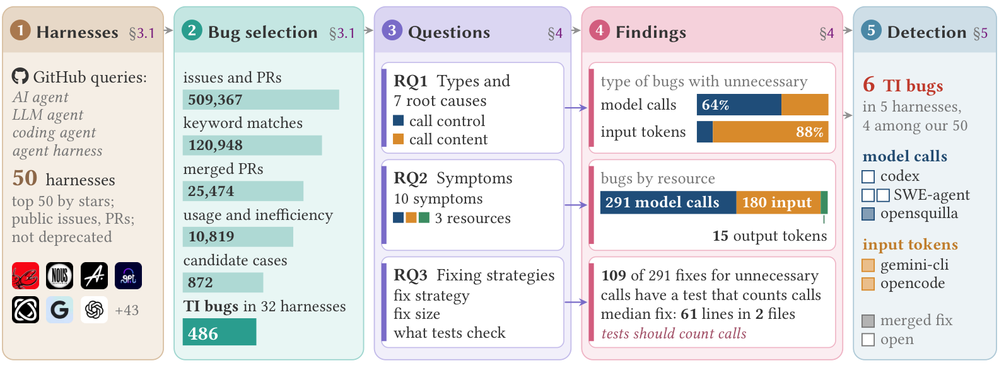

# Where Do the Tokens Go? Characterizing Token Inefficiency Bugs in LLM Agent Harnesses

[](LICENSE)
[](https://creativecommons.org/licenses/by/4.0/)
[](https://www.python.org/)

This repository accompanies the paper *Where Do the Tokens Go? Characterizing Token Inefficiency Bugs in LLM Agent
Harnesses*. It contains the 486 token inefficiency (TI) bugs that the study labeled, the code that collects the candidate
cases from GitHub, and a script that computes the main results of RQ1-RQ3 from the labeled bugs.

> **Anonymized for double-blind review.** Author names, the citation and links to the authors' other work will be added
> after the review.

A **TI bug** is a bug in the agent harness that makes an agent call the model more often, or read or generate more tokens,
than the design and settings of the harness require. Each TI bug in the dataset is a merged pull request (PR) that fixes
it, together with the issues that the PR closes.

<p align="center">
  
</p>

## Project Structure

```
token-inefficiency-bugs/
├── data/
│   └── ti_bugs.csv              # the 486 labeled TI bugs (one row per bug)
├── code/
│   ├── step1_collect.py         # Step 1: keyword search of 50 harnesses; merged PRs and the issues they close
│   ├── step2_classify.py        # Step 2: word filter and LLM classifier (the prompt is in this file)
│   ├── step3_results.py         # Step 3: results of RQ1-RQ3 computed from data/ti_bugs.csv (standard library only)
│   ├── config.example.yaml      # configuration (GitHub token, LLM endpoint and model); keys come from environment variables
│   └── requirements.txt         # Python packages for Steps 1 and 2
├── figs/
│   └── overview.png             # overview of the study (Figure 2 of the paper)
├── LICENSE
└── README.md
```

## Data

### Dataset Statistics

The bugs were selected from the issues and PRs of 50 popular open-source agent harnesses on GitHub, created up to the
cutoff date of July 31, 2026 (Section 3.1 of the paper).

| Stage | Count |
|---|---:|
| Issues and PRs of the 50 harnesses | 509,367 |
| Issues and PRs that match a keyword | 120,948 |
| Merged PRs among them (with the issues they close) | 25,474 |
| PRs whose text mentions both token usage and inefficiency (word filter) | 10,819 |
| Candidate cases, selected based on the LLM classifier's judgments | 872 |
| **TI bugs** (labeled, Section 3.2), in 32 harnesses | **486** |

The 32 harnesses with TI bugs include 14 coding agents (168 bugs) and 18 general assistants or agent frameworks (318
bugs), written in TypeScript, Python, Rust and Go.

**Types and root causes (RQ1).**

| Root cause | Call-control | Call-content | Total |
|---|---:|---:|---:|
| Faulty stop condition | 124 | 5 | 129 |
| Faulty request content | 1 | 127 | 128 |
| Faulty setting delivery | 2 | 59 | 61 |
| Faulty response interpretation | 43 | 10 | 53 |
| Faulty state tracking | 18 | 33 | 51 |
| Faulty model feedback | 0 | 36 | 36 |
| Faulty token accounting | 23 | 5 | 28 |
| **Total** | **211** | **275** | **486** |

**Symptoms by resource (RQ2).**

| Resource | Symptoms (bugs) | Total |
|---|---|---:|
| Model calls | repeated actions (113), repeated model requests (76), summarization calls (41), separate model calls (36), unexpected continuation (25) | 291 |
| Input tokens | context bloat (68), prompt cache misses (60), over-limit context (27), oversized tool results (25) | 180 |
| Output tokens | unexpected output (15) | 15 |

### Data File: `data/ti_bugs.csv`

UTF-8, comma-separated, one header row, one row per TI bug. A list in a cell is separated by semicolons.

| Column | Meaning |
|---|---|
| `id` | The bug, as `owner/repo#PR`. |
| `repo` | The harness (GitHub repository, as named at the cutoff date). |
| `pr_url`, `pr_title` | The merged PR that fixes the bug. |
| `linked_issues` | URLs of the issues that the PR closes (may be empty). |
| `type` | `call-control` (the bug affects whether the harness calls the model) or `call-content` (it affects what a call carries). |
| `root_cause` | `faulty stop condition`, `faulty request content`, `faulty setting delivery`, `faulty response interpretation`, `faulty state tracking`, `faulty model feedback` or `faulty token accounting`. |
| `call_site` | Where the model call happens: `main loop` (353 bugs) or `other call site` (133), such as a sub-agent, a summarization call or a scheduled task. |
| `resource` | The resource in which the bug causes unnecessary usage: `Model calls`, `Input tokens` or `Output tokens`. |
| `symptom` | One of the ten symptoms in the table above. |
| `symptom_subtype` | The form within a symptom, for the symptoms that have subtypes (empty otherwise). |
| `noticed_by` | The evidence that the issue or PR gives for the inefficiency: `runtime behavior` (306), `inspection of requests or context` (105), `usage or cost figures` (60) or `not stated` (15). |
| `fix_strategy` | The main strategy of the fix, such as `loop or stop guard`, `content reduction`, `provider mapping` or `response classification`. |
| `test_checks` | What the tests changed by the fix check (a list): `call count`, `request`, `prompt cache`, `token count`, `other behavior`, `no relevant assertion` or `no test change`. |
| `fix_lines`, `fix_files` | Lines and files changed by the fix, not counting test and documentation files. |

## Code

### Paper Component Map

| Paper part | Data | Script | Reproduces |
|---|---|---|---|
| Section 3.1, Step 1 | GitHub (live) | `code/step1_collect.py` | issue and PR counts of the 50 harnesses, keyword matches, merged PRs |
| Section 3.1, Step 2 | output of Step 1 | `code/step2_classify.py` | word filter (10,819 PRs) and the classifier's judgments, the basis for selecting the candidate cases |
| Section 3.2 | `data/ti_bugs.csv` | (labels) | the 486 TI bugs and their labels |
| Section 4.1 (RQ1) | `data/ti_bugs.csv` | `code/step3_results.py` | types, root causes, faulty stop conditions in the main loop versus other call sites |
| Section 4.2 (RQ2) | `data/ti_bugs.csv` | `code/step3_results.py` | resources and symptoms, how developers noticed the inefficiency, symptoms versus root causes (Cramér's V) |
| Section 4.3 (RQ3) | `data/ti_bugs.csv` | `code/step3_results.py` | main fix strategy of each root cause, fix size, what the tests of the fixes check |

Step 3 runs offline from the released CSV in a few seconds. Steps 1 and 2 re-collect the data from GitHub and need a
GitHub token and an LLM API key.

### Quick Start: Reproduce the Results

Step 3 needs only Python 3.9 or later and its standard library.

```bash
python3 code/step3_results.py          # readable summary of RQ1-RQ3
python3 code/step3_results.py --json   # the same numbers as JSON
```

Expected output (abridged):

```
TI bugs: 486 in 32 harnesses

RQ1  Types and Root Causes
  types: call-content 275, call-control 211
  faulty stop conditions cause 79 (22%) of 353 bugs in the main loop but 50 (38%) of 133 at other call sites

RQ2  Symptoms
  resources: Model calls 291 (60%) of 486, Input tokens 180 (37%) of 486, Output tokens 15 (3%) of 486
  noticed in the runtime behavior: model calls 239 (82%) of 291, input tokens 57 (32%) of 180

RQ3  Fixing Strategies
  fixes that use the main strategy of their root cause: 331 (68%) of 486
  fix size (tests and documentation excluded): median 61 lines in 2 files; 206 (42%) of 486 change one file
  fixes of bugs that cause unnecessary model calls with a test that counts calls: 109 (37%) of 291 ...
```

### Re-collecting the Data (Steps 1 and 2)

```bash
pip install -r code/requirements.txt
cp code/config.example.yaml code/config.yaml
export GITHUB_TOKEN=...          # Step 1: read-only access to public repositories is enough
export ANTHROPIC_API_KEY=...     # Step 2 (or the variable named in llm.api_key_env)
python3 code/step1_collect.py    # -> work/repo_counts.csv, work/keyword_matches.csv, work/merged_prs.jsonl
python3 code/step2_classify.py   # -> work/rule_filter.csv, work/classifier_scores.csv
```

- **Step 1** searches the titles and bodies of the issues and PRs of the 50 harnesses for the keywords listed in the
  script, keeps the merged PRs that are not reverts, and records the issues that each PR closes.
- **Step 2** keeps a PR when its text and the text of its issues mention both token usage and inefficiency, then asks an
  LLM, through its API, three questions about each remaining PR: whether it fixes a bug, whether the same task uses fewer
  tokens after the fix, and whether it changes the code, prompts or settings of the harness. The prompt is in
  `code/step2_classify.py`. The default configuration uses Claude Opus-5 at temperature 0. In `code/config.yaml`,
  `llm.api` (`anthropic` or `openai`), `llm.base_url` and `llm.model` select any endpoint that speaks the Anthropic
  Messages API or the OpenAI Chat Completions API, and `llm.api_key_env` names the environment variable that holds its
  key; `max_tokens` and `temperature` are set there too (some models accept only temperature 1). The script records,
  for each PR, the probability of a yes to each question and a one-sentence reason; the candidate cases of the paper were
  selected based on these judgments. An optional `threshold` only marks the PRs whose three probabilities all reach it,
  to help screening. `--limit N` judges only the first N PRs, to test a setup before a full run.
- The candidate cases were then labeled with the codebook described in Section 3.2 of the paper; no script repeats this
  step.

A new run gives counts close to, but not equal to, those of the paper: GitHub search results change over time, the merged
state of a PR is read at query time, and the answers of an LLM can vary.

## Ethics

The dataset describes bugs that were reported and fixed in public open-source repositories. It contains the title and the
URL of each PR and the URLs of its issues; the texts of the issues and PRs belong to their authors and are not
redistributed. The data contain no personal information beyond the public repository names.

## License

Code: MIT (see [`LICENSE`](LICENSE)). Data: [CC BY 4.0](https://creativecommons.org/licenses/by/4.0/).
